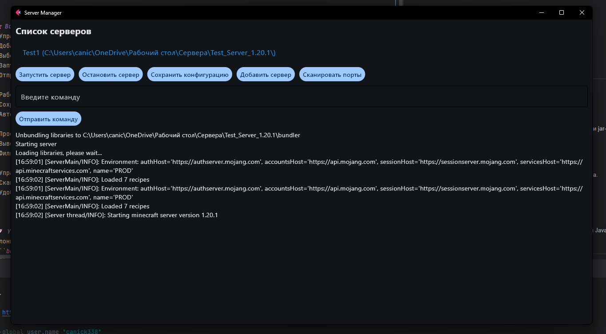
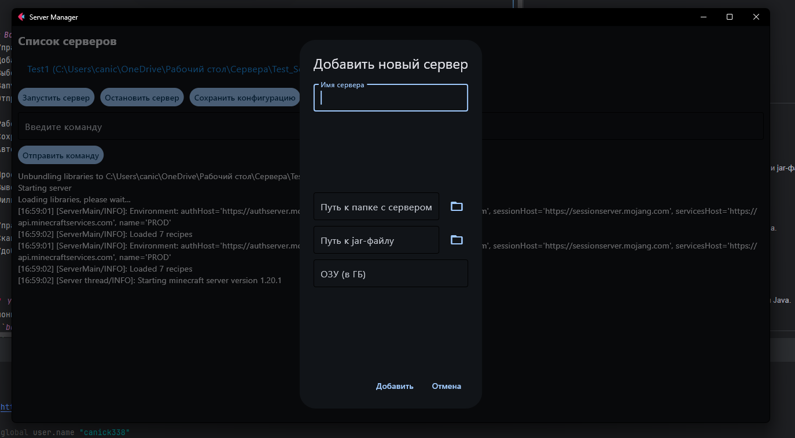
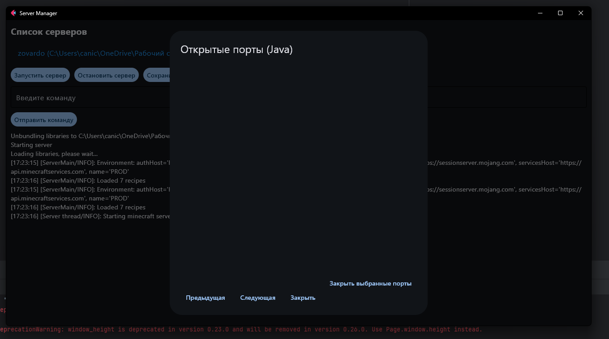

# Minecraft Server Manager

**Minecraft Server Manager** — это приложение с удобным графическим интерфейсом на базе [Flet](https://flet.dev/), предназначенное для управления серверами Minecraft. Программа позволяет добавлять серверы, переключаться между ними, запускать/останавливать их, отправлять команды, а также управлять конфигурациями.

---

## 📸 Скриншоты
### Главный экран


### Добавление нового сервера


### Сканирование портов


---

## 🛠 Возможности:

### Управление серверами:
- Добавление серверов Minecraft с указанием пути к папке и jar-файлу.
- Выбор текущего сервера для работы.
- Запуск и остановка серверов.
- Отправка команд на выбранный сервер.

### Работа с конфигурациями:
- Сохранение и загрузка настроек серверов из JSON-файла.
- Автоматическое сохранение списка серверов.

### Просмотр логов:
- Вывод логов для текущего сервера.
- Фильтрация логов и возможность их очистки.

### Управление портами:
- Сканирование открытых портов, связанных с процессами Java.
- Просмотр всех портов, используемых запущенными серверами.
- Удобный интерфейс для выбора и закрытия ненужных портов.

---

## 🚀 Установка и запуск:
1. Клонируйте репозиторий:
   ```bash
   git clone https://github.com/canick338/Minecraft-Server-Manager.git
